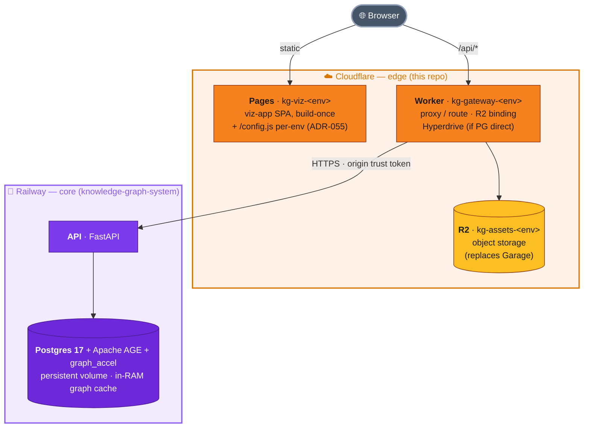

# kg-cloud


Cloud deployment repository for **[Kappa Graph — κ(G)](https://github.com/aaronsb/knowledge-graph-system)**.

This repo does not contain the application. It contains the *deployment* of it.
Kappa Graph is pulled in as a git submodule (`vendor/kg`, pinned to its `release`
branch) and shipped to a hybrid cloud topology with a reproducible, environment-
promoted pipeline.

## Honest topology: it's two clouds, not one

The name says "cloud," not "cloudflare," on purpose. Kappa Graph doesn't fit on a
single serverless provider, and pretending otherwise would be dishonest. The data
layer is genuinely stateful — Apache AGE Postgres with a custom Rust `graph_accel`
extension that loads the whole graph into RAM and is ABI-locked to the `apache/age`
image. Cloudflare has no persistent-volume database primitive, so the database
lives where it can: **Railway** (see the kg feasibility study).



| Lives on Cloudflare | Lives on Railway |
|---|---|
| viz-app (Pages) | FastAPI API |
| Object storage (R2, replaces Garage) | Postgres 17 + Apache AGE + `graph_accel` |
| Edge API gateway (Worker, optional) | Persistent volume + backups |

The decision and its alternatives are recorded in
[ADR-001](docs/architecture/ADR-001-hybrid-cloudflare-railway-deployment.md).

## Layout

```
kg-cloud/
├── vendor/kg/              # submodule -> knowledge-graph-system @ release
├── apps/gateway/           # CF Worker edge gateway (phase 3)
├── config/                 # window.APP_CONFIG templates, per environment
├── scripts/                # build-web, gen-config, bump-kg
├── wrangler.toml           # multi-env: dev / stage / production
├── Makefile                # install / build / deploy / secrets-sync
├── .github/workflows/      # deploy.yml -- branch -> environment
└── docs/architecture/      # ADRs
```

## Environments

Mirrors the praecipio deployment reference: branch -> GitHub Environment ->
Cloudflare environment, all routed through `make` so local and CI share one path.

| Branch | GH Environment | Cloudflare env | Notes |
|---|---|---|---|
| `main` | `production` | `production` | gated by required-reviewer |
| `stage` | `stage` | `stage` | staging |
| (local) | — | `dev` | `make dev` |

Secrets (`CLOUDFLARE_API_TOKEN`, `CLOUDFLARE_ACCOUNT_ID`, API origin token, …)
live in GitHub Environment Secrets and are synced to Cloudflare at deploy time.
None are committed to this repo.

## Updating Kappa Graph

The submodule is pinned to a specific kg `release` commit for reproducible
deploys. To ship a newer kg:

```bash
make bump-kg        # advance vendor/kg to the latest kg release tag
git commit vendor/kg -m "chore(kg): bump to <tag>"
```

## Status

Phase 1 (foundation + viz-app -> Pages). Pipeline lands in follow-up PRs.

## License

Apache-2.0, matching [knowledge-graph-system](https://github.com/aaronsb/knowledge-graph-system).
